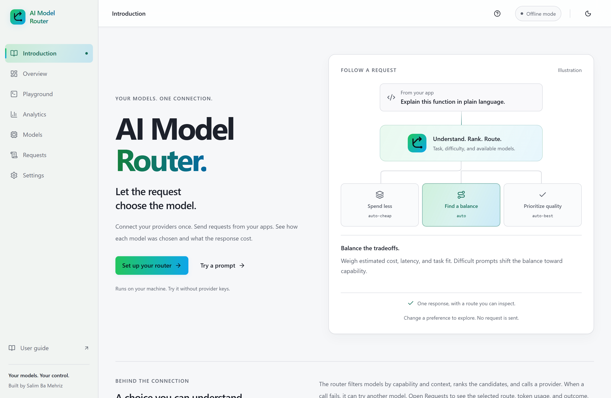
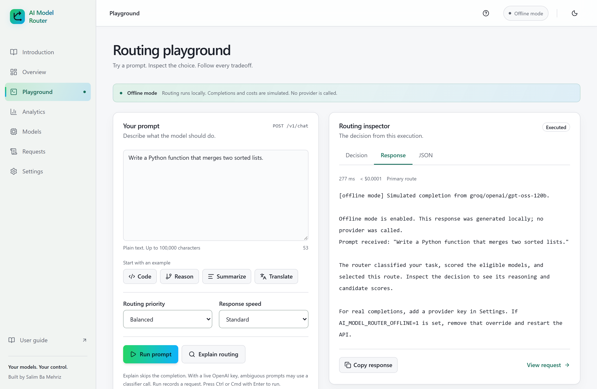
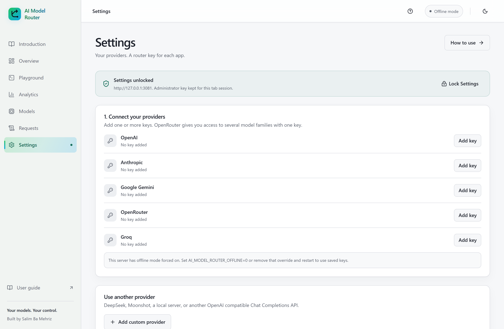
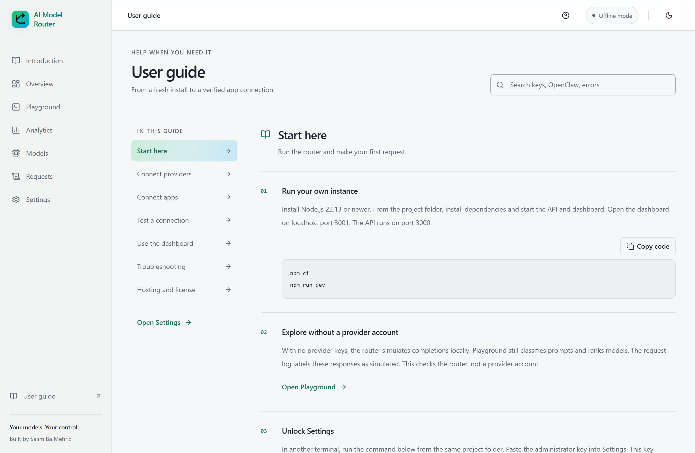
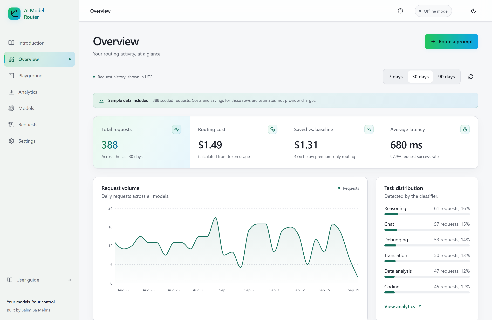
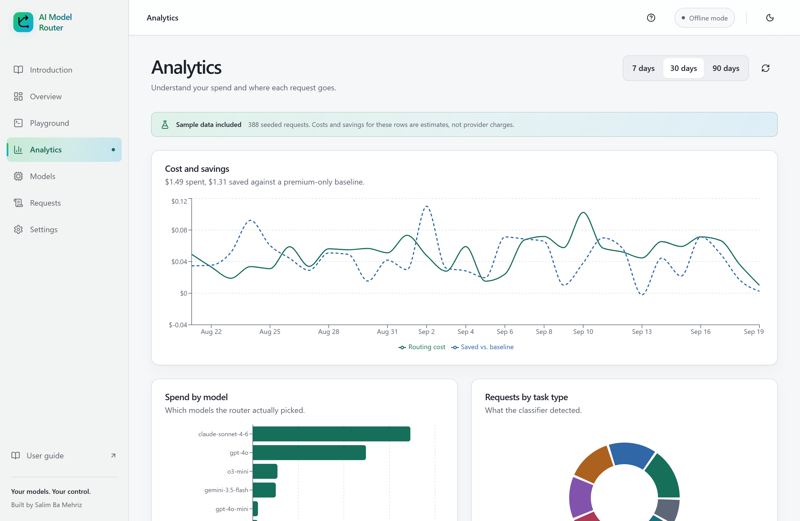
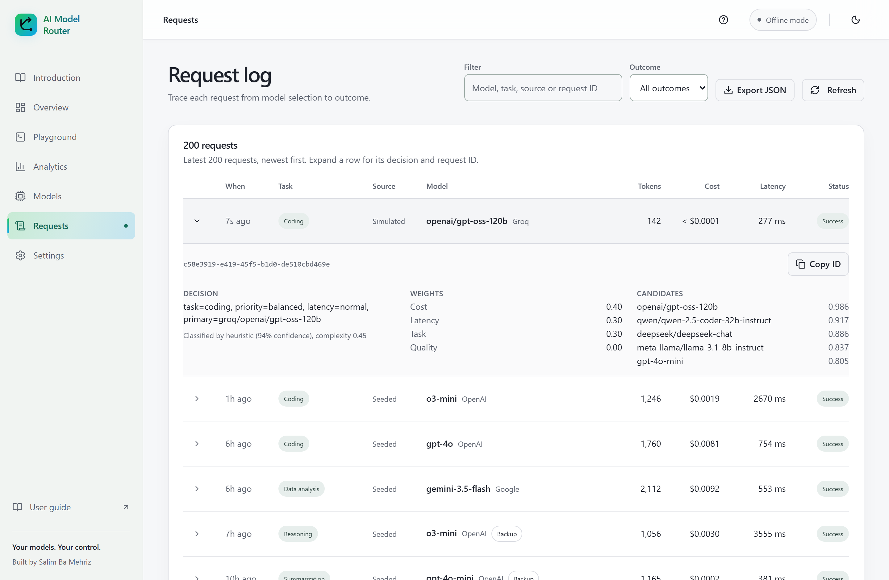
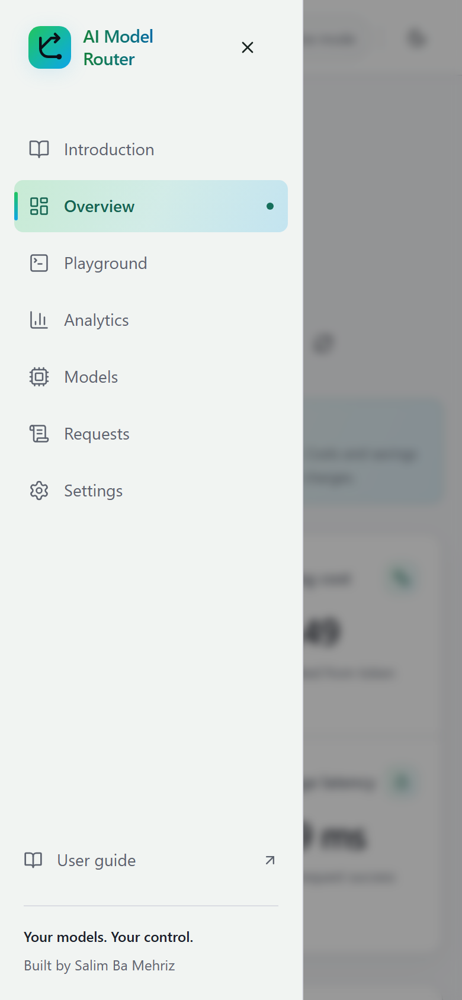
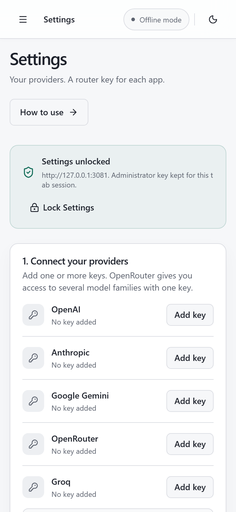

# AI Model Router

A router you can run on your own machine. Connect model providers once, give your apps one endpoint, and inspect how each request was routed.

Built with TypeScript, Fastify, React, and SQLite. Try it without provider accounts using clearly labeled offline completions. Connect real providers when you are ready.



## Run it locally

Install Node.js 22.13 or newer. From the repository folder, run these commands.

```sh
npm ci
npm run dev
```

Open http://localhost:3001. The API runs at http://localhost:3000. SQLite creates `apps/api/data/ai-model-router.db` on first start.

On Windows, if the dashboard stops during startup with `Error during dependency optimization` and an `UNKNOWN: unknown error, open ...\node_modules\.vite\deps_temp_...` path, a real-time antivirus scanner opened a file that Vite had just written. Run `npm run dev` again. If it keeps happening, exclude the repository folder from real-time scanning.

1. Open **User guide** for setup instructions inside the application.
2. Run `npm run admin:key` in another terminal. Use that administrator key to unlock **Settings**.
3. Add a provider key. Built in adapters support OpenAI, Anthropic, Gemini, OpenRouter, and Groq. **Add custom provider** accepts another API using OpenAI Chat Completions with bearer authentication.
4. Under **Connect your apps**, create a named router key and copy it once. Give this key to your app.
5. Use `http://localhost:3000/v1` as the client base URL and `auto` as the model. Settings includes an OpenClaw configuration.
6. Run a prompt in **Playground**, then open **Requests** to inspect the route.

Provider keys authorize upstream model calls. Router keys authorize your apps to use this server. The administrator key manages Settings. Keep these roles separate.

Without provider keys, responses are simulated locally. To add or remove labeled sample history for charts, use these commands.

```sh
npm run demo:seed
npm run demo:clear
```

## Follow a request

The router estimates task type and difficulty, filters models by capability and context, then ranks the remaining candidates using cost, latency, and task fit. It can retry transient failures and fall back to another eligible model.

The completion and saved routing decision share a request ID. Inspect the selected model, candidate scores, token usage, estimated cost, and fallback outcome in the dashboard.



| Area | Implementation |
| --- | --- |
| Routing | Heuristic classification, optional classifier escalation, capability constraints, weighted ranking |
| Providers | Five built in adapters and configurable providers using OpenAI Chat Completions |
| Clients | Model discovery, JSON completions, buffered SSE, and function tool conversations |
| Storage | SQLite migrations, WAL, transactional request and decision writes, indexed reporting |
| Credentials | Encrypted provider keys, administrator access, independently revocable router keys stored as hashes |
| Interface | Light and dark themes, responsive navigation, searchable guide, routing inspector, request search and export |
| Reporting | Date filters, cost estimates, and explicit labels for live, offline, seeded, and legacy traffic |
| Verification | Unit and integration tests, coverage gates, production smoke checks, and real HTTP simulations |

Quality scores and task strengths are estimates, not benchmark results. The curated catalog includes a local snapshot and can refresh pricing and context metadata from the [OpenRouter catalog](https://openrouter.ai/api/v1/models). Custom model metadata remains under your control.

## Connect your providers and apps

Use **Settings** to save, replace, and remove provider keys. Saved credentials are encrypted with AES 256 GCM. The local encryption key is stored beside the database in `credentials.key`. Saving a key does not make a provider call or validate account credit.

For DeepSeek, Moonshot, or another compatible API, enter its base URL, key, exact model ID, prices, context window, and tool capability under **Add custom provider**. The router appends `/chat/completions`. Use **Add model** for more models and **Edit model and key** to update an existing entry. Native protocols and alternative authentication formats require an adapter.



Environment keys still work through `apps/api/.env`. Copy `apps/api/.env.example` to get started. Environment values take precedence and must be changed on the server, followed by a restart.

For OpenClaw or another compatible client, select `openai-completions`, set the router base URL, and use a generated router key. Supported aliases are `auto`, `auto-cheap`, and `auto-best`. A remote client needs a reachable router address. Its localhost refers to its own machine.

The [integration guide](docs/INTEGRATIONS.md) includes OpenClaw configuration, a Node.js example, and private tunneling. The same practical guidance is available through **User guide** inside the application.

## Verify your connection

The [client testing guide](docs/TESTING-CLIENTS.md) explains how to test your own provider account and router key.

```powershell
$env:AI_MODEL_ROUTER_BASE_URL = 'http://localhost:3000/v1'
$routerTestSecret = Read-Host 'Router key' -AsSecureString
$env:AI_MODEL_ROUTER_KEY = [System.Net.NetworkCredential]::new('', $routerTestSecret).Password
npm run test:client
npm run test:client -- --tools
Remove-Item Env:AI_MODEL_ROUTER_KEY
```

The basic test makes two provider requests. The tools option makes four in total, including a harmless function call and result. Provider charges apply. Run it from the machine hosting your client to check network reachability too.

To verify revocation, use a disposable router key, confirm the test passes, revoke it in Settings, and run the test again with that key. Model discovery must return 401. Requests already in progress are not cancelled.



## More of the interface

These are real screenshots of the running application. Charts use labeled sample history and the Playground shows an actual offline execution. Their costs are simulated estimates.

<details>
<summary>Overview, analytics, request tracing, and mobile</summary>











</details>

## Run one production server

```sh
npm ci
npm run build
npm start
```

Open http://localhost:3000. The Node server serves both the API and dashboard. Use one running instance and a persistent disk. For remote access, terminate HTTPS and configure the bind address. The included [Render blueprint](render.yaml) uses paid compute and a persistent disk. See [deployment and backup instructions](docs/DEPLOYMENT.md).

| Variable | Default | Purpose |
| --- | --- | --- |
| `DATABASE_PATH` | `data/ai-model-router.db` | SQLite path relative to the API working directory |
| `HOST` and `PORT` | `127.0.0.1` and `3000` | Server bind address |
| `AI_MODEL_ROUTER_ADMIN_KEY` | Derived from the encryption key | Optional administrator secret of at least 32 characters |
| `AI_MODEL_ROUTER_ENCRYPTION_KEY` | Local `credentials.key` | Optional base64 encoded secret containing 32 random bytes |
| `AI_MODEL_ROUTER_API_KEY` | Unset | Legacy shared API key |
| `AI_MODEL_ROUTER_OFFLINE` | Automatic | `1` forces simulated completions, `0` forces live ones. Any other value stops the server |
| `AI_MODEL_ROUTER_DISABLE_CATALOG_FETCH` | Unset | `1` disables the public catalog refresh. Any other value stops the server |
| `CORS_ORIGIN` | `http://localhost:3001` | Allowed dashboard origin |
| `RATE_LIMIT_MAX` and `RATE_LIMIT_WINDOW_SEC` | `100` and `60` | Request limit per instance. `RATE_LIMIT_MAX=0` turns off the shared budget, and leaves the 60 per minute per address that guessing a key spends |

Back up the database and its encryption key together. See [Security](SECURITY.md) for credential storage, authentication boundaries, and vulnerability reporting.

## Develop and verify

```sh
npm run check
npm run test:smoke
npm run test:simulation
npx playwright install chromium
npm run test:browser
npm audit
```

The quality gate runs lint, type checks, API coverage tests, dashboard display tests, and both production builds. CI also runs the production smoke test and HTTP simulation on Linux and Windows, and the browser check on Linux. The browser check drives Chromium over every page and state in both themes and fails on any text, focus indicator, or hover state below its contrast floor. It needs a browser, so it is not part of `npm run check`. The simulation starts isolated router and provider servers, checks tools, fallback, retries, persistence, and revocation, then removes its temporary data. It does not contact a paid provider or an installed OpenClaw gateway.

Coverage gates require 90 percent lines and statements, 95 percent functions, and 80 percent branches. See [verification scope](docs/VERIFICATION.md), [contributing](CONTRIBUTING.md), [API reference](docs/API.md), and [routing algorithm](docs/algorithm.md).

## Scope

The router is designed for one operator with a separate router key for each app. It supports text and function tools. Gemini is text only in the compatibility endpoint. Images, audio, embeddings, the Responses API, and provider specific reasoning extensions are not implemented.

Streaming uses standard SSE with keepalives while the provider completes, followed by buffered content or tool deltas. It does not expose token by token upstream generation. One completion is supported per request.

Costs are estimates using reported tokens and catalog rates. They exclude some provider fees and optional classifier calls. Savings compare against a fixed premium baseline. `max_cost` is an estimated routing filter, not a billing cap. Experimental boost makes multiple calls and cannot use that cap. Failed calls without usage and discarded boost work are not included in fallback cost estimates.

Request history shows the latest 200 records. Analytics aggregate the selected UTC date range. Prompt and completion bodies are not stored in the request log. Provider access and compatibility must still be verified with your own account and installed client.

## License

Built by [Salim Ba Mehriz](https://github.com/SBamehriz). Distributed under [PolyForm Shield 1.0.0](LICENSE).

Personal use and internal commercial use are permitted. Providing a competing router product or service requires separate permission, including when that competing offering is free. This is source available software, not OSI open source. The license has no scheduled conversion to MIT. Third-party code included under its own MIT terms keeps those permissions. See [licensing](docs/LICENSING.md) and [notices](NOTICE) for the full scope.
